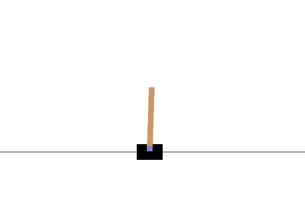
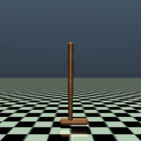
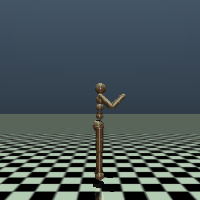
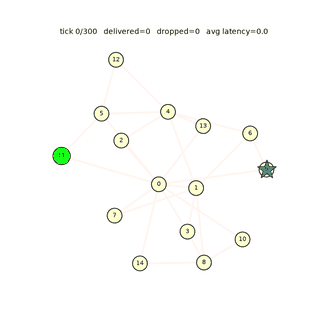
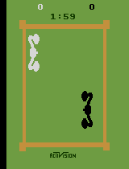

# Reinforcement Learning Zoo


Clean, well-documented implementations of core RL algorithms, built to demonstrate scientific rigour: reproducible experiments, structured evaluation, and clear learning curves.

### Contents

- [Demos](#demos)
- [Algorithms](#algorithms)
- [Repo structure](#repo-structure)
- [Quick start](#quick-start)
- [Design principles](#design-principles)

---

## Demos

<table>
<tr>
<td align="center" width="33%">
<br>
<b>DQN</b> · CartPole-v1 · greedy eval, return 500/500
</td>
<td align="center" width="33%">
<br>
<b>SAC</b> · Hopper-v5 (MuJoCo, 3D) · greedy eval, return ≈3565, full 1000-step episode
</td>
<td align="center" width="33%">
<br>
<b>SAC</b> · Humanoid-v5 (MuJoCo, 3D, 17 DOF) · greedy eval, return ≈5147 ± 11, walks forward for the full 1000-step episode
</td>
</tr>
<tr>
<td align="center" width="33%">
<br>
<b>PPO</b> · FlappyBird-v0 (flappy-bird-gymnasium) · greedy eval, return 22.6, clears multiple pipes
</td>
<td align="center" width="33%">
<br>
<b>GNN-PPO</b> (custom) · NetworkRoutingEnv · greedy eval · learned routing competitive with shortest-path, purely from reward signal
</td>
<td align="center" width="33%">
<br>
<b>DQN</b> (Double + Dueling, CNN) · ALE/Boxing-v5 · greedy eval, return 100/100 (knockout in 223/1780 steps)
</td>
</tr>
</table>

GIFs are generated straight from a saved checkpoint with [`scripts/record_video.py --format gif`](scripts/record_video.py) (no manual editing) — MuJoCo scenes need `--width`/`--height` and `--gif_colors` to keep the file size sane (a raw-resolution, full-palette GIF hit 15MB; downscaled + palette-quantized it's ~1.5MB). See that script's usage examples for the exact command.

---

## Algorithms

| Algorithm | Type | Action Space | Status |
|-----------|------|-------------|--------|
| REINFORCE | On-policy PG | Discrete / Continuous | ✅ Done |
| Actor-Critic (A2C) | On-policy PG w/ baseline | Discrete / Continuous | ✅ Done |
| PPO | On-policy actor-critic | Discrete / Continuous | ✅ Done |
| DQN (+ Double, Dueling) | Off-policy value | Discrete | ✅ Done |
| SARSA | On-policy value | Discrete | ✅ Done |
| DDPG | Off-policy actor-critic | Continuous | ✅ Done |
| TD3 | Off-policy actor-critic | Continuous | ✅ Done |
| SAC | Off-policy actor-critic | Continuous | ✅ Done |
| MuJoCo Hopper-v5 (3D) | via SAC | Continuous | ✅ Done — see demo above |
| MuJoCo Humanoid-v5 (3D, 17 DOF) | via SAC | Continuous | ✅ Done — see demo above |
| FlappyBird-v0 (flappy-bird-gymnasium) | via PPO | Discrete | ✅ Done — see demo above |
| GNN-PPO (custom graph policy) | via PPO, NetworkRoutingEnv | Discrete (masked) | ✅ Done — matches shortest-path baseline, see demo above |

Each algorithm's theory notes live next to its code, e.g. [`agents/dqn/README.md`](agents/dqn/README.md).

---

## Repo structure

```
Reinforcement-Learning/
│
├── configs/                  # YAML hyperparameter files (one per experiment)
├── envs/
│   └── wrappers.py           # make_env factory + RecordEpisodeStats / NormalizeObs / ClipReward
│
├── agents/
│   ├── base_agent.py         # Abstract interface: select_action / update / save / load
│   ├── reinforce/            # ReinforceAgent + Categorical/Gaussian policies
│   ├── actor_critic/         # ActorCriticAgent (MC returns + learned baseline)
│   ├── ppo/                  # PPOAgent + its own fixed-T rollout buffer
│   ├── dqn/                  # DQNAgent (target net, soft updates, ε-greedy)
│   ├── sarsa/                # SarsaAgent (target network, mini-batch on-policy)
│   ├── ddpg/                 # DDPGAgent + actor/critic nets + exploration noise
│   ├── td3/                  # TD3Agent (twin critics, delayed policy updates)
│   └── sac/                  # SACAgent (max-entropy, auto-tuned temperature)
│       └── (each agent dir has agent.py, networks.py, and an algorithm README)
│
├── common/
│   ├── registry.py           # build_agent(): config -> agent instance, shared by all scripts
│   ├── replay_buffer.py      # ReplayBuffer (off-policy) + RolloutBuffer (on-policy MC returns)
│   ├── logger.py             # W&B + CSV logger
│   ├── schedulers.py         # LinearSchedule, ExponentialSchedule (ε decay)
│   └── utils.py              # build_mlp, soft_update, set_seed, load_config, explained_variance
│
├── training/
│   └── trainer.py            # Five loops: on-policy / actor-critic / ppo / sarsa / off-policy
│
├── evaluation/
│   └── evaluator.py          # evaluate_agent(), Evaluator (CSV export)
│
├── scripts/
│   ├── train.py              # CLI: python scripts/train.py --config ...
│   ├── evaluate.py           # CLI: evaluate a saved checkpoint
│   └── record_video.py       # CLI: record an MP4 or GIF rollout of a trained policy
│
├── notebooks/                # Analysis, learning curves, ablations
├── assets/demos/             # Curated GIFs referenced from this README
├── results/                  # Checkpoints, CSV metrics, W&B runs, videos/gifs (git-ignored)
└── tests/
    └── test_core.py          # Unit tests for buffers, schedulers, save/load
```

---

## Quick start

```bash
# Install
pip install -r requirements.txt
pip install -e .

# Train — algorithm is inferred from the config filename's prefix
python scripts/train.py --config configs/reinforce_cartpole.yaml
python scripts/train.py --config configs/dqn_cartpole.yaml --device cuda --seed 123
python scripts/train.py --config configs/ppo_lunarlander.yaml
python scripts/train.py --config configs/ddpg_pendulum.yaml

# Train SAC on a 3D MuJoCo env (needs `pip install mujoco`; see configs/sac_hopper.yaml
# and configs/sac_humanoid.yaml for tuned hyperparameters and expected training time)
python scripts/train.py --config configs/sac_hopper.yaml

# Evaluate a checkpoint
python scripts/evaluate.py \
    --config configs/reinforce_cartpole.yaml \
    --checkpoint results/checkpoints/reinforce_cartpole/ReinforceAgent_ep200.pt \
    --n_episodes 20

# Record an MP4 of the trained policy (needs ffmpeg or imageio[ffmpeg])
python scripts/record_video.py --config <cfg> --checkpoint <ckpt>

# Record a checkpoint's rollout as a GIF (imageio, no ffmpeg needed)
python scripts/record_video.py \
    --config configs/dqn_cartpole.yaml \
    --checkpoint results/checkpoints/dqn_cartpole/DQNAgent_ep1100.pt \
    --format gif --max_frames 200 --output_dir assets/demos

# Same, but for a 3D MuJoCo env — downscale + reduce the palette or the GIF
# balloons to 10-20MB (raw MuJoCo frames don't compress like flat 2D scenes)
python scripts/record_video.py \
    --config configs/sac_hopper.yaml \
    --checkpoint results/checkpoints/sac_hopper/SACAgent_ep1700.pt \
    --format gif --max_frames 200 --width 200 --height 200 --gif_colors 128 \
    --output_dir assets/demos

# Train PPO on FlappyBird (needs `pip install flappy-bird-gymnasium`; the
# env_kwargs.use_lidar: false in the config keeps obs a 12-dim feature vector)
python scripts/train.py --config configs/ppo_flappybird.yaml --device cuda

# Run tests
pytest tests/ -v
```

`WANDB_MODE=disabled` short-circuits W&B logging without editing configs.

---

## Design principles

**One interface for all agents.** `BaseAgent` enforces `select_action / update / save / load`. Adding a new algorithm = subclass + YAML config.

**Configs over magic numbers.** Every hyperparameter lives in `configs/`. Experiments are fully reproducible by sharing the YAML file and seed.

**Separate concerns.** The `Trainer` owns the loop; the agent owns the math. Swapping algorithms never touches the training code.

**Scientific evaluation.** `Evaluator` runs N greedy episodes, reports mean ± std, and exports CSV. Results can also be logged to Weights & Biases.

**Tested core.** `tests/test_core.py` covers buffers, schedulers, and agent save/load so refactors don't silently break things.