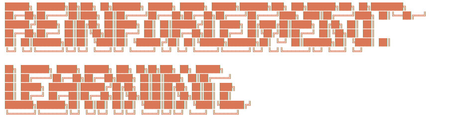

# Reinforcement Learning Zoo



Clean, well-documented implementations of core RL algorithms, built to demonstrate scientific rigour: reproducible experiments, structured evaluation, and clear learning curves.


---

## Algorithms

| Algorithm | Type | Action Space | Status |
|-----------|------|-------------|--------|
| REINFORCE | On-policy PG | Discrete / Continuous | ✅ Done |
| DQN (+ Double, Dueling) | Off-policy value | Discrete | 🔜 |
| PPO | On-policy actor-critic | Discrete / Continuous | 🔜 |
| DDPG | Off-policy actor-critic | Continuous | 🔜 |
| TD3 | Off-policy actor-critic | Continuous | 🔜 |
| SAC | Off-policy actor-critic | Continuous | 🔜 |

---

## Repo structure

```
Reinforcement-Learning/
│
├── configs/                  # YAML hyperparameter files (one per experiment)
├── envs/
│   └── wrappers.py           # RecordEpisodeStats, NormalizeObs, ClipReward, FrameStack
│
├── agents/
│   ├── base_agent.py         # Abstract interface: select_action / update / save / load
│   └── reinforce/
│       ├── agent.py          # ReinforceAgent
│       ├── networks.py       # CategoricalPolicy, GaussianPolicy
│       └── README.md         # Algorithm theory + implementation notes
│
├── common/
│   ├── replay_buffer.py      # ReplayBuffer (off-policy) + RolloutBuffer (on-policy, GAE)
│   ├── logger.py             # W&B + CSV logger
│   ├── schedulers.py         # Linear / Exponential / Cosine schedules
│   └── utils.py              # build_mlp, soft_update, set_seed, explained_variance
│
├── training/
│   └── trainer.py            # train_on_policy() and train_off_policy() loops
│
├── evaluation/
│   └── evaluator.py          # evaluate_agent(), Evaluator (CSV export)
│
├── scripts/
│   ├── train.py              # CLI: python scripts/train.py --config ...
│   └── evaluate.py           # CLI: evaluate a saved checkpoint
│
├── notebooks/                # Analysis, learning curves, ablations
├── results/                  # Figures, CSV metrics, checkpoints (git-ignored)
└── tests/
    └── test_core.py          # Unit tests for all shared components
```

---

## Quick start

```bash
# Install
pip install -r requirements.txt
pip install -e .

# Train REINFORCE on CartPole-v1
python scripts/train.py --config configs/reinforce_cartpole.yaml

# Evaluate a checkpoint
python scripts/evaluate.py \
    --config configs/reinforce_cartpole.yaml \
    --checkpoint results/checkpoints/reinforce_cartpole/ReinforceAgent_ep200.pt

# Run tests
pytest tests/ -v
```

---

## Design principles

**One interface for all agents.** `BaseAgent` enforces `select_action / update / save / load`. Adding a new algorithm = subclass + YAML config.

**Configs over magic numbers.** Every hyperparameter lives in `configs/`. Experiments are fully reproducible by sharing the YAML file and seed.

**Separate concerns.** The `Trainer` owns the loop; the agent owns the math. Swapping algorithms never touches the training code.

**Scientific evaluation.** `Evaluator` runs N greedy episodes, reports mean ± std, and exports CSV. Results can also be logged to Weights & Biases.

**Tested core.** `tests/test_core.py` covers buffers, schedulers, and agent save/load so refactors don't silently break things.